1. Моніторинг метрик EC2 в CloudWatch

Відкрити AWS CloudWatch → Metrics → EC2 → InstanceId.

- CPUUtilization (завантаження CPU)
- MemoryUtilization (завантаження пам’яті, якщо активовано CloudWatch Agent).

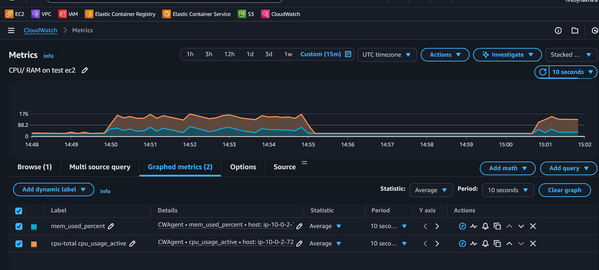

> Саме за вказаним шляхом `AWS CloudWatch → Metrics → EC2 → InstanceId` метрики відстуні, просте вони пристуні за `AWS CloudWatch → Metrics → CWAgent` 

2. Налаштування CloudWatch Alarms для CPU та пам’яті

Відкрити AWS CloudWatch → Alarms.

- CPU > 80% протягом 5 хвилин
- Memory > 75% протягом 5 хвилин

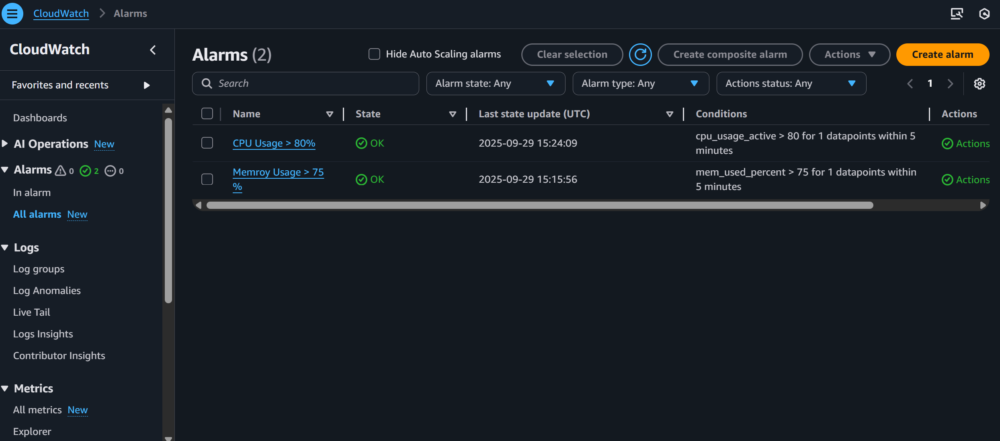

> Память я пізніше зменшив до 50% бо `streess` падає якщо задаєш більше ніж є free

3. Налаштування SNS-сповіщень

Відкрити Amazon SNS → Topics → Ваш топік.

- Створений SNS-топік
- Вказано вашу email-адресу
- Підтвердження підписки (Subscription confirmed)
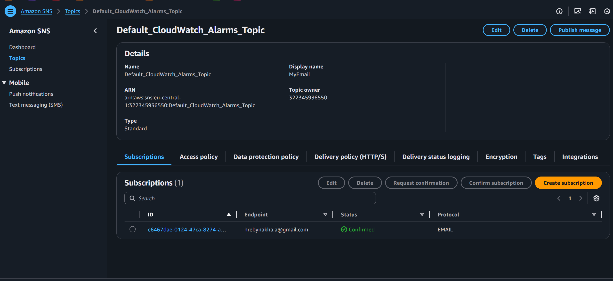

4. Перевірка спрацювання аларму (створення навантаження)

Підключитися до EC2 через SSH

Виконати команду для створення навантаження:

`stress --cpu 2 --timeout 300`

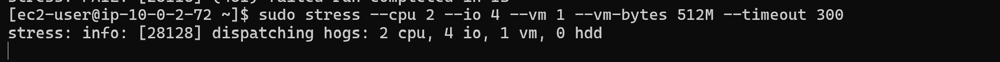
CloudWatch → Alarms, Alarm in ALARM state.

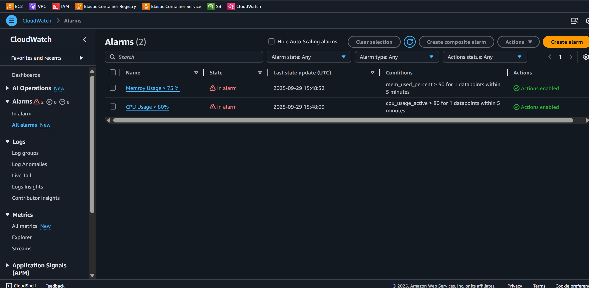

5. Отримане email-сповіщення про перевищення порогу

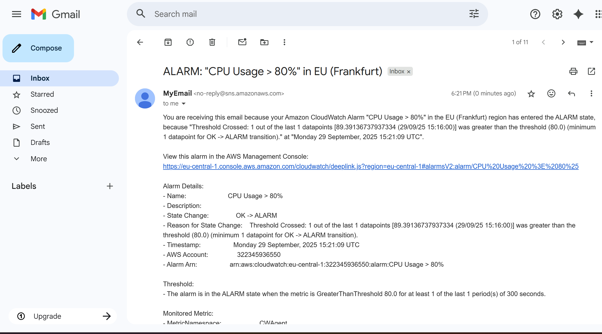
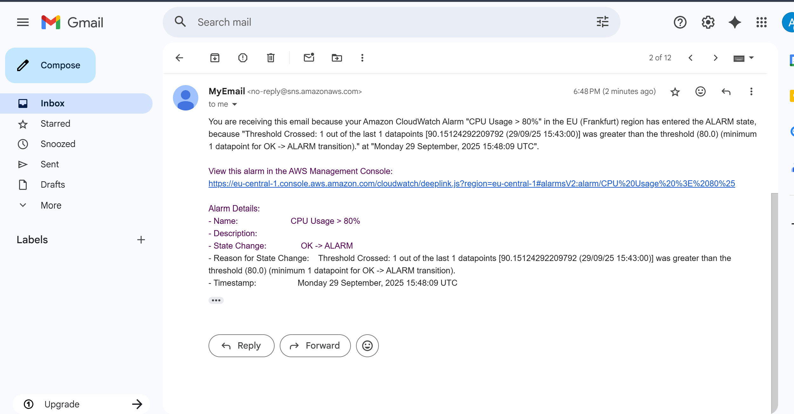 
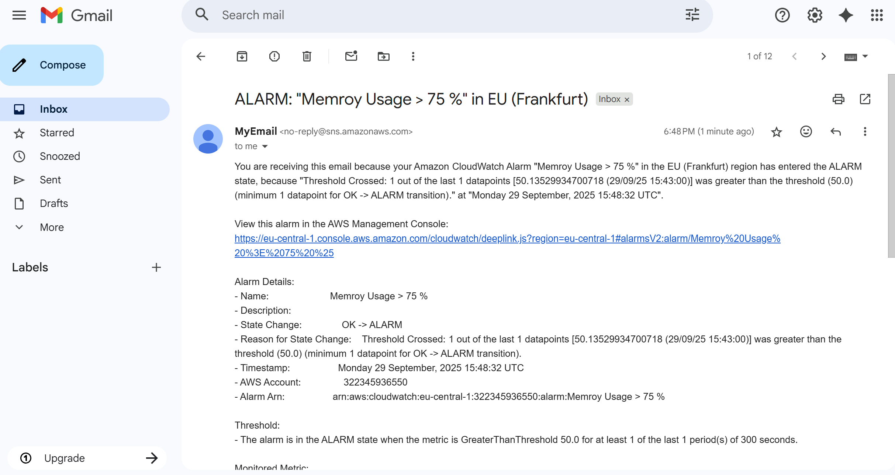

> P.S. довго грався з RAM > 75%

6. Графік навантаження

Відкрити CloudWatch → Metrics → EC2 → CPUUtilization.

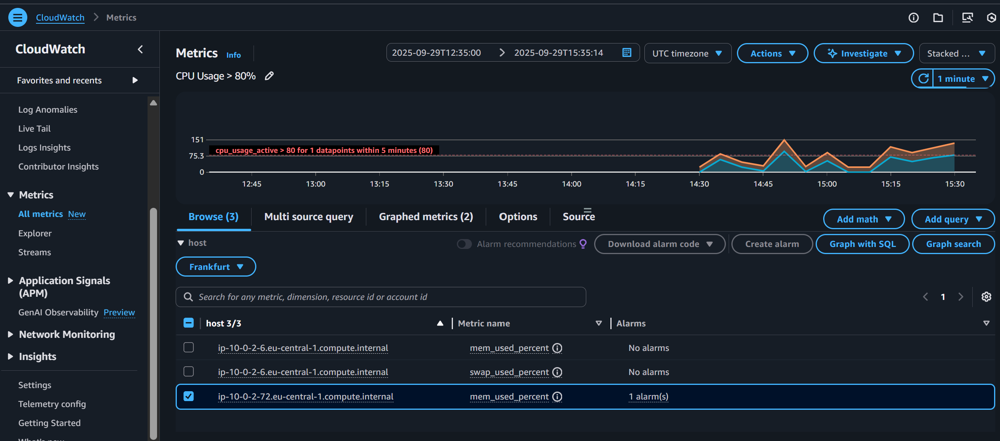

7. Видалення ресурсів (якщо потрібно)

Відкрити AWS CloudWatch → Alarms → Delete.

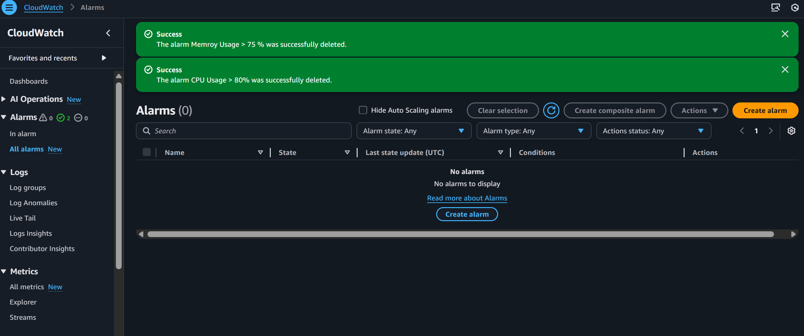

Відкрити AWS CloudWatch → SNS → Delete topic.
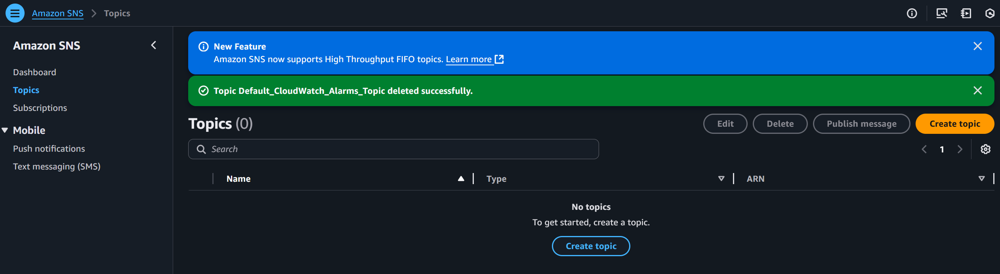
